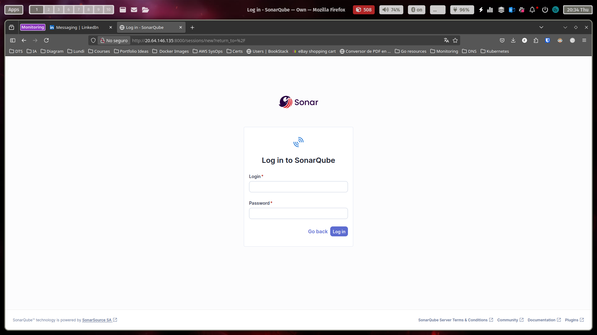
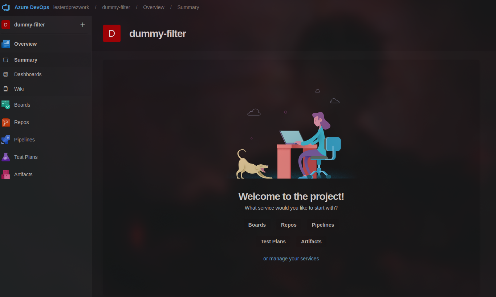
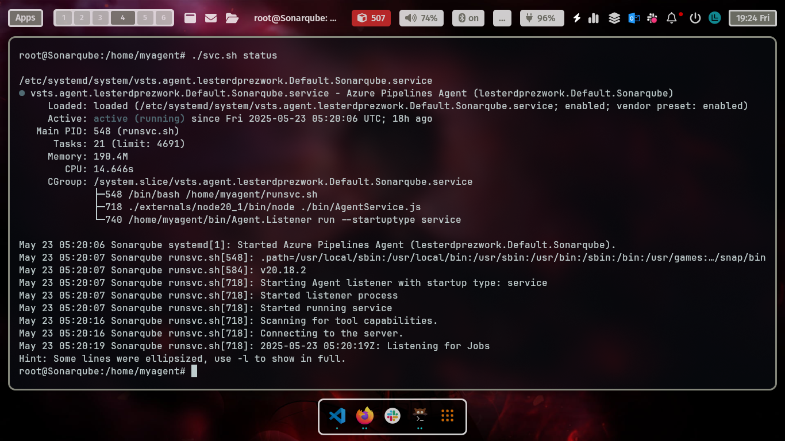
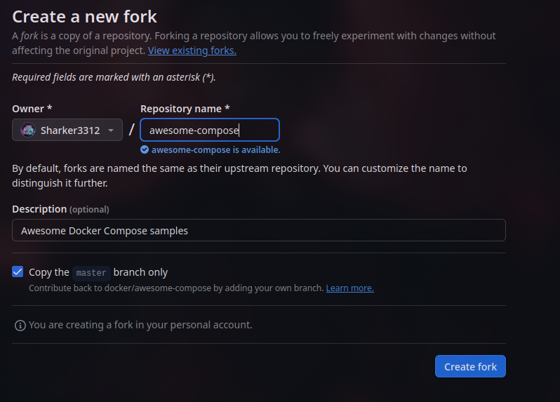
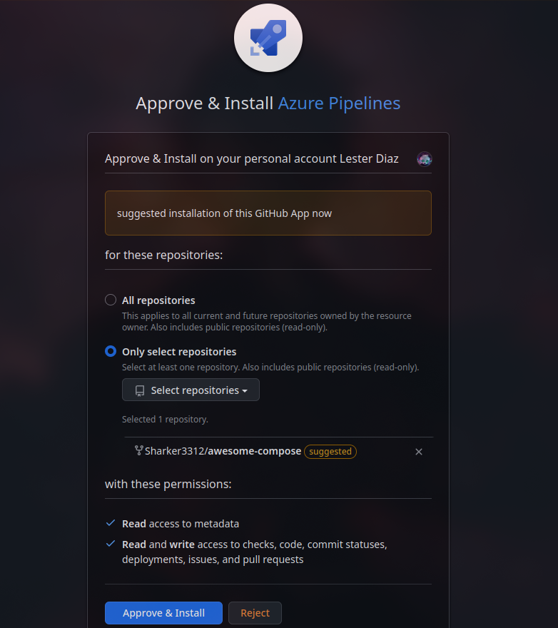
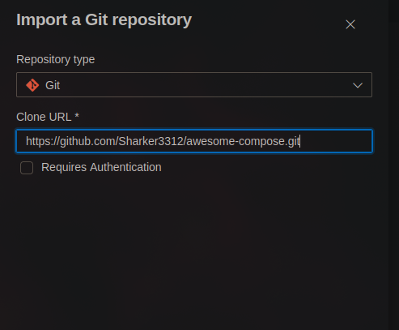
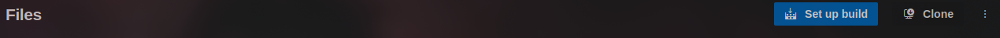
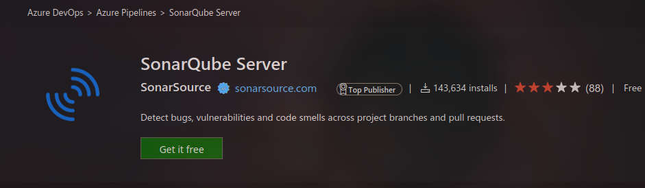

# Prueba-Dummy

## Herramientas instaladas

- **SonarQube** (instalado en Azure VM) http://20.64.146.135:8000
 
- **Organización de Azure DevOps** (`dummy-filter`)
  
- **Docker** (usado en el pipeline)  
- **Azure Agent Pool Self-Hosted** 
  
- **Kubernetes (AKS)**  
- **Minikube / Hypervisor / Nube** con conexión a Azure DevOps  

---

## Procedimiento

1. **Descargar los archivos** del repositorio elegido:  
   [Repositorio Angular](https://github.com/docker/awesome-compose/tree/master/angular)

2. **Instalar el framework** necesario en caso de no tenerlo. 

3. **Compilar la aplicación** luego de pasar el análisis de SonarQube.  

   - Agregar dos escenarios:  
     - Escenario 1: Análisis fallido  
     - Escenario 2: Análisis exitoso

4. **Generar una imagen de Docker** y subirla a DockerHub, ACR o ECR desde el pipeline YAML.

5. **Ejecutar dentro del pipeline** lo siguiente (en Bash o PowerShell):

   - Imprimir "Hola Mundo" 10 veces usando un job paralelo.  
   - Script que cree 10 archivos con la fecha actual y luego los imprima en consola.

6. **Desplegar la aplicación** a un clúster de Kubernetes (Minikube, EKS o AKS).

7. **Crear un endpoint externo accesible** (Ingress) para la aplicación.

8. **Subir al repositorio** una carpeta llamada `environment` con todos los archivos YAML de Kubernetes.

---
1.**Descargar los archivos** del repositorio elegido:  
   [Repositorio Angular](https://github.com/docker/awesome-compose/tree/master/angular)

   foto de repo escogido
   Aclaracion: Los archivos los voy a descargar mediante la clonacion del repositorio dentro de un stage del pipeline en azure

   Le hago un fork al repositorio con el objetivo de poder vincularlo desde mi azure pipelines. 
    
    

    Clono el repo en vscode para borrar todo lo que no tenga que ver con el proyecto de angular ya que no quiero que de descarguen archivos innecsarios.

    Modificamos el repo con 
    git add .
    git commit -m "DEL out of scope"
    git push

    Luego importamos el repositorio en la
    seccion Repos de Azure Devops

   
   En este caso por motivos de rapidez deje el repo publico pero se que se debiera poner privado y autenticarlo con una key

   Vamos a crear el pipeline en Azure devOps
   

   

   Para aniadir conectar sonarqube con azure pipelines primero debemos crearnos un token en de acceso en sonarqube
    My Account > Security > Generate Tokens

    Para integrar sonarqube nos vamos al market place y buscamos la el pipeline predefinido de *Sonarqube Server*.
   

   En el pipeline aniadimos en mismo stage las task de sonarqube ya que comparten variables internas.
   - Preparacion
   - Analisis
   - Publicaicon de resultados
   

