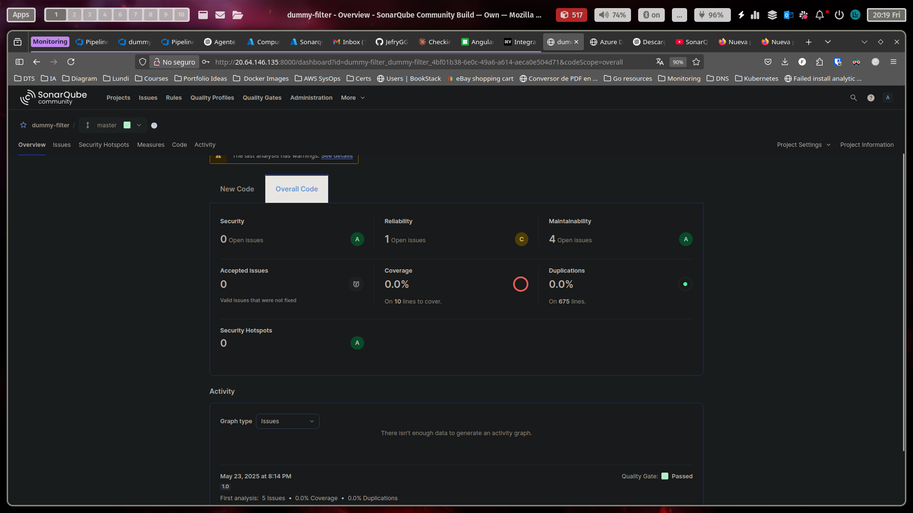

# Prueba-Dummy

## Herramientas instaladas

- ✅ **SonarQube** en Azure VM – [http://20.64.146.135:8000](http://20.64.146.135:8000)
 
- ✅ **Azure DevOps** – Organización: `dummy-filter`
  
- ✅ **Docker** – Usado en el pipeline  
- ✅ **Agentes Self-Hosted** – Azure Agent Pool configurado 
  
- ✅ **Kubernetes (AKS)** – Cluster desplegado con Terraform  
- ✅ **Minikube/Hypervisor/Nube** – Conectado a Azure DevOps 

---

## Procedimiento

### 1. Selección del repositorio
- Se utilizó el proyecto **Angular** de [Awesome Compose](https://github.com/docker/awesome-compose/tree/master/angular)  
- Se hizo **fork** y limpieza del repo para incluir solo los archivos del proyecto Angular.  
- Se importó a **Azure DevOps Repos**.

### 2. Integración de SonarQube
- Proyecto creado en SonarQube con su respectivo `project-key`.
- Se generó un token de acceso desde SonarQube.
- Se configuró el pipeline en Azure con:
  - 🔹 Tarea de preparación
  - 🔹 Análisis de código
  - 🔹 Publicación de resultados 

- Se implementaron dos escenarios:
  - ❌ Escenario 1: Análisis fallido (con código deliberadamente incorrecto)
  - ✅ Escenario 2: Análisis exitoso (código limpio)

### 3. Imagen Docker
- Se construyó la imagen desde Azure Pipelines.
- ✅ Imagen subida a **Docker Hub** desde el pipeline

### 4. Jobs paralelos en pipeline
- Se configuraron dos agentes en una misma VM.
- ✅ Se ejecutaron en paralelo:
  - 🔹 Script para imprimir “Hola Mundo” 10 veces.
  - 🔹 Script para crear 10 archivos con la fecha actual e imprimir su contenido.

### 5. Despliegue a Kubernetes
- ✅ Se utilizó **Terraform** para crear un clúster AKS en Azure.  
- ✅ Se generó un **Helm Chart** personalizado para la app Angular.  
- ✅ Se configuró un **Ingress** para exponer el servicio públicamente:  
  - URL pública: [http://130.131.154.154/](http://130.131.154.154/)

---

## ✅ Requisitos cumplidos

- [x] Infraestructura desde cero  
- [x] Documentación clara y funcional  
- [x] Estándares de codificación  
- [x] Enfoque DevOps integral  

---

## ⭐ Bonus completados

| Bonus                                                                 | Cumplido |
|-----------------------------------------------------------------------|----------|
| Uso de IaC (Terraform)                                               | ✅        |
| Manejador de templates (Helm)                                        | ✅        |
| Despliegue en nube pública (Azure)                                   | ✅        |
| Accesibilidad desde internet (Ingress público)                       | ✅        |
| Uso de prácticas DevOps (CI/CD, análisis estático, automatización)   | ✅        |

---

# 🚀 Documentación del Proyecto – DevOps End-to-End con Angular

## 1️⃣ Descarga y preparación del repositorio
   Se utilizó como base el siguiente repositorio de ejemplo de Docker:

   🔗 [Repositorio Angular - Awesome Compose](https://github.com/docker/awesome-compose/tree/master/angular)

   📌 Para trabajar cómodamente y mantener control total, se realizó un **fork** del repositorio original.  
   🔧 Luego, se clonó localmente en VS Code para limpiar todos los archivos innecesarios y dejar únicamente lo relacionado con el proyecto Angular.

   
   

## 2️⃣ Importación y configuración en Azure DevOps
   Se importó el repositorio modificado a Azure DevOps en la sección **Repos** para poder integrarlo con los pipelines.

   
   
   
   *Nota:* Por rapidez el repositorio quedó público, pero se recomienda usar repositorios privados autenticados con tokens o llaves SSH para mayor seguridad.

## 3️⃣ Creación del Pipeline en Azure DevOps
   

   

## 4️⃣ Integración con SonarQube para análisis de calidad

Para asegurar la calidad del código, se integró SonarQube en el pipeline.

Pasos realizados:

- Generación de un token de acceso en SonarQube (My Account > Security > Generate Tokens).
- Instalación del task predefinido “SonarQube Server” desde el Marketplace de Azure DevOps.
- Agregado de tareas SonarQube en el pipeline en un solo stage para compartir variables internas:
  - Preparación (Prepare analysis)
  - Análisis
  - Publicación de resultados
- Creación del proyecto en SonarQube para obtener el `project-key` y definir el nombre del proyecto.

---
   
## 5️⃣ Construcción y publicación de la imagen Docker

Dentro del pipeline se agregó la lógica para:

- Loguearse en Docker Hub con credenciales.
- Construir la imagen Docker del proyecto Angular.
- Pushear la imagen al repositorio público en Docker Hub.

Esto permite que la imagen esté disponible para despliegues posteriores.

  

   Jobs  en paralelo para ellos debemos tener dos agentes configurados
   
   

   En este momoento ya contamos con todo lo requerido 
   

Procederemos a instalar un sencillo cluster de Kubernetes en la nube de Azure mediante terraform. 

## 6️⃣ Configuración y despliegue en Kubernetes con Terraform y Helm

Para el despliegue en producción se implementó lo siguiente:

- Creación de un clúster de Kubernetes en Azure (AKS) usando Terraform para infraestructura como código.
- Despliegue de la aplicación Angular con un Helm Chart personalizado.
- Configuración de un Ingress Controller para exponer el servicio públicamente.
- Verificación del despliegue mediante acceso a la IP pública del clúster.

Además, se configuró una conexión de Kubernetes en Azure DevOps Service Connections para integrar el pipeline con el clúster AKS y facilitar despliegues automáticos.

---

Bien para vincular el helm chart a nuestro pipeline en azure debemos crear una conexion de Kubernetes en service Connectiosn primero

Una vez instalado el cluster mediante terraform corremos el helm chart para desplegar nuestra aplicacion.  Verificamos que todo este bien funcionando y el ingress este exponiniendo nuestro servicio

http://130.131.154.154/

## 🏁 Conclusión

Este proyecto demuestra una solución DevOps completa, desde la gestión del código hasta el despliegue en producción en la nube, con integración continua y aseguramiento de la calidad del código.

✨ ¡Todo orquestado y automatizado en Azure DevOps!