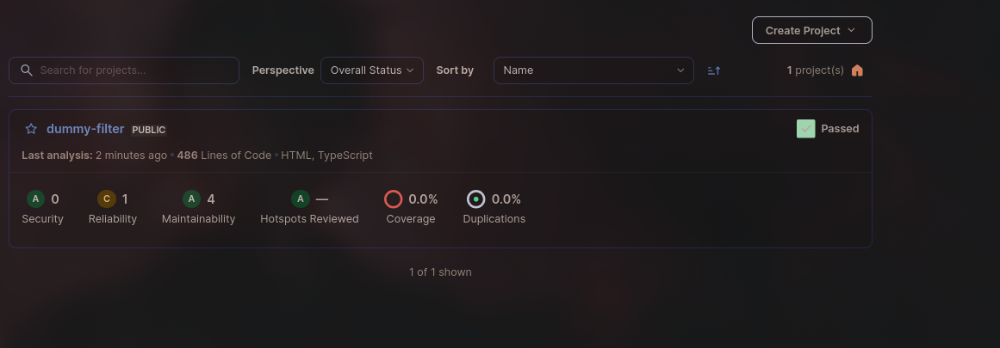
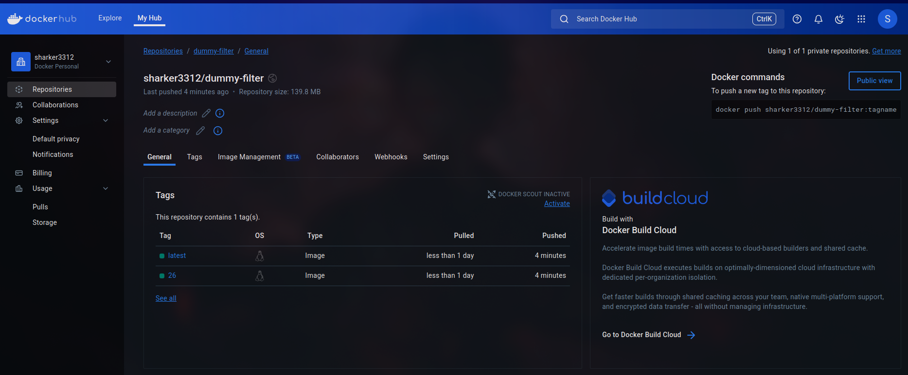
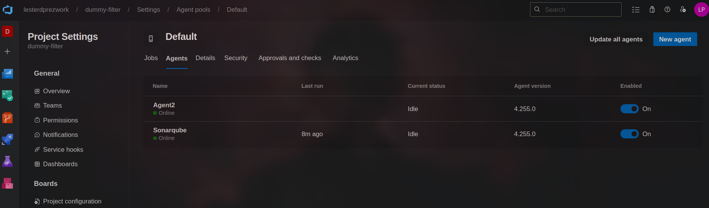
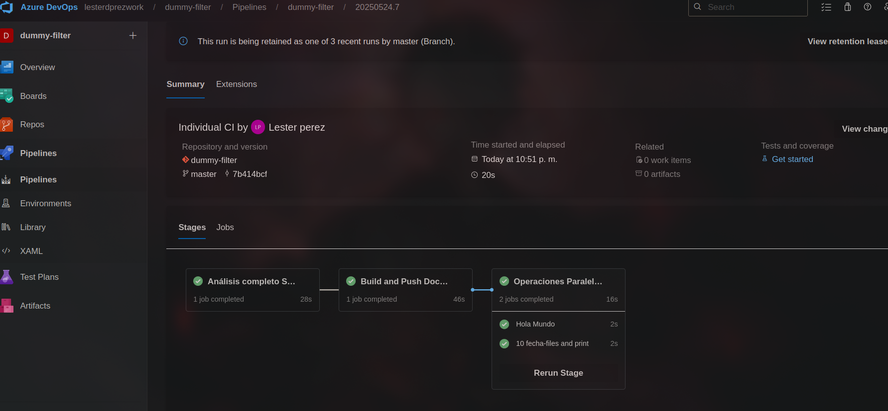
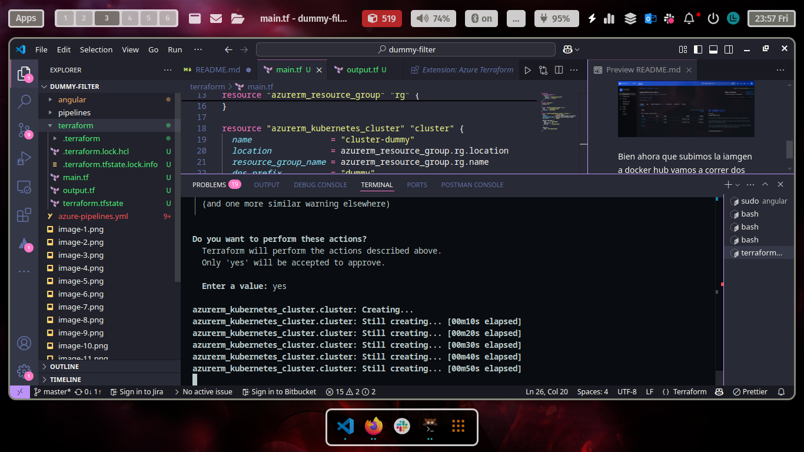
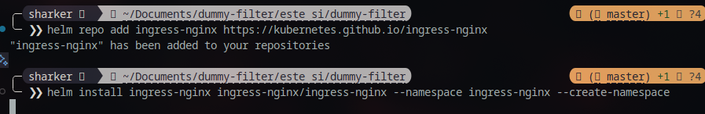
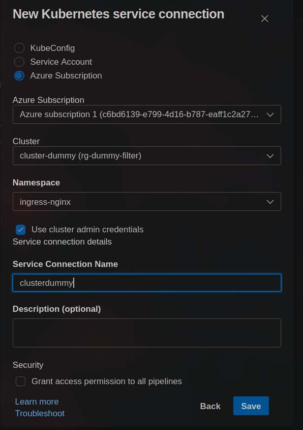
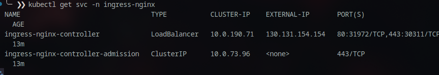
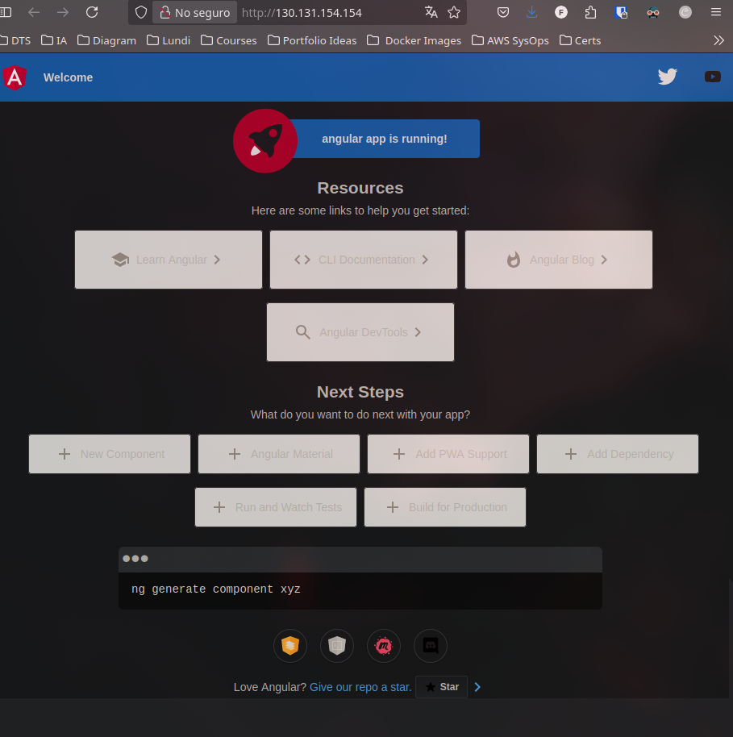
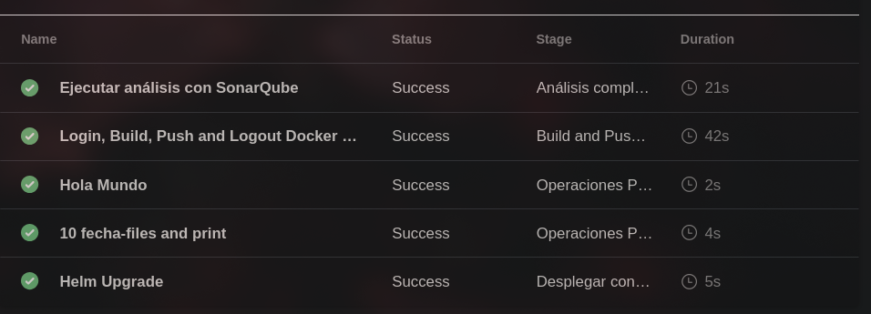

# Prueba-Dummy

## 📋 Tabla de Contenidos
- [Herramientas Instaladas](#herramientas-instaladas)
- [Procedimiento](#procedimiento)
  - [1. Selección del Repositorio](#1-selección-del-repositorio)
  - [2. Integración de SonarQube](#2-integración-de-sonarqube)
  - [3. Imagen Docker](#3-imagen-docker)
  - [4. Jobs Paralelos en Pipeline](#4-jobs-paralelos-en-pipeline)
  - [5. Despliegue a Kubernetes](#5-despliegue-a-kubernetes)
- [Requisitos Cumplidos](#-requisitos-cumplidos)
- [Bonus Completados](#-bonus-completados)
- [Documentación Detallada del Proyecto](#-documentación-del-proyecto--devops-end-to-end-con-angular)
  - [Descarga y Preparación](#1️⃣-descarga-y-preparación-del-repositorio)
  - [Importación en Azure DevOps](#2️⃣-importación-y-configuración-en-azure-devops)
  - [Creación del Pipeline](#3️⃣-creación-del-pipeline-en-azure-devops)
  - [Integración con SonarQube](#4️⃣-integración-con-sonarqube-para-análisis-de-calidad)
  - [Construcción y Publicación de Docker](#5️⃣-construcción-y-publicación-de-la-imagen-docker)
  - [Configuración de Kubernetes](#6️⃣-configuración-y-despliegue-en-kubernetes-con-terraform-y-helm)
  - [Conclusión](#-conclusión)
- [Documentación del Código](#-documentación-del-código)
  - [Pipeline de CI/CD](#azure-devops-pipeline)
  - [Infraestructura como Código](#infraestructura-como-código-terraform)
  - [Configuración de Kubernetes](#configuración-de-kubernetes-helm-chart)
  - [Descripción del Flujo](#descripción-técnica-del-flujo)


## ⭐ Bonus Completados

| Bonus                                                                 | Cumplido |
|-----------------------------------------------------------------------|----------|
| Uso de IaC (Terraform)                                               | ✅        |
| Manejador de templates (Helm)                                        | ✅        |
| Despliegue en nube pública (Azure)                                   | ✅        |
| Accesibilidad desde internet (Ingress público)                       | ✅        |
| Uso de prácticas DevOps (CI/CD, análisis estático, automatización)   | ✅        |

---

## Herramientas Instaladas

- ✅ **SonarQube** en Azure VM – [http://20.64.146.135:8000](http://20.64.146.135:8000)
- ✅ **Azure DevOps** – Organización: `dummy-filter`
- ✅ **Docker** – Usado en el pipeline  
- ✅ **Agentes Self-Hosted** – Azure Agent Pool configurado 
- ✅ **Kubernetes (AKS)** – Cluster desplegado con Terraform  
- ✅ **Minikube/Hypervisor/Nube** – Conectado a Azure DevOps 

<div align="center">
  
  
  
</div>

---

## Procedimiento

### 1. Selección del Repositorio
- Se utilizó el proyecto **Angular** de [Awesome Compose](https://github.com/docker/awesome-compose/tree/master/angular)  
- Se hizo **fork** y limpieza del repo para incluir solo los archivos del proyecto Angular  
- Se importó a **Azure DevOps Repos**

<div align="center">
  
  
</div>

### 2. Integración de SonarQube
- Proyecto creado en SonarQube con su respectivo `project-key`
- Se generó un token de acceso desde SonarQube
- Se configuró el pipeline en Azure con:
  - 🔹 Tarea de preparación
  - 🔹 Análisis de código
  - 🔹 Publicación de resultados 

- Se implementaron dos escenarios:
  - ❌ Escenario 1: Análisis fallido (con código deliberadamente incorrecto)
  - ✅ Escenario 2: Análisis exitoso (código limpio)

**Archivo de configuración SonarQube:**

```properties
# Clave única del proyecto en SonarQube
sonar.projectKey=dummy-filter
sonar.projectName=dummy-filter
sonar.projectVersion=1.0

# Directorio raíz del código fuente
sonar.sources=angular/angular/src

# Extensiones que serán analizadas (TS, HTML, CSS)
sonar.inclusions=**/*.ts, **/*.html, **/*.css

# Archivos a excluir (por ejemplo, pruebas unitarias)
sonar.exclusions=**/*.spec.ts, **/test/**, **/e2e/**

# Configuración del lenguaje
sonar.language=ts

# Codificación de archivos
sonar.sourceEncoding=UTF-8
```

<div align="center">
  
  
</div>

### 3. Imagen Docker
- Se construyó la imagen desde Azure Pipelines
- ✅ Imagen subida a **Docker Hub** desde el pipeline

<div align="center">
  
</div>

### 4. Jobs Paralelos en Pipeline
- Se configuraron dos agentes en una misma VM
- ✅ Se ejecutaron en paralelo:
  - 🔹 Script para imprimir "Hola Mundo" 10 veces
  - 🔹 Script para crear 10 archivos con la fecha actual e imprimir su contenido

<div align="center">
  
  
</div>

### 5. Despliegue a Kubernetes
- ✅ Se utilizó **Terraform** para crear un clúster AKS en Azure  
- ✅ Se generó un **Helm Chart** personalizado para la app Angular  
- ✅ Se configuró un **Ingress** para exponer el servicio públicamente:  
  - URL pública: [http://130.131.154.154/](http://130.131.154.154/)

<div align="center">
  
  
</div>

---

## ✅ Requisitos Cumplidos

- [x] Infraestructura desde cero  
- [x] Documentación clara y funcional  
- [x] Estándares de codificación  
- [x] Enfoque DevOps integral  

---

## ⭐ Bonus Completados

| Bonus                                                                 | Cumplido |
|-----------------------------------------------------------------------|----------|
| Uso de IaC (Terraform)                                               | ✅        |
| Manejador de templates (Helm)                                        | ✅        |
| Despliegue en nube pública (Azure)                                   | ✅        |
| Accesibilidad desde internet (Ingress público)                       | ✅        |
| Uso de prácticas DevOps (CI/CD, análisis estático, automatización)   | ✅        |

---


# 🚀 Documentación del Proyecto – DevOps End-to-End con Angular

## 1️⃣ Descarga y preparación del repositorio
   Se utilizó como base el siguiente repositorio de ejemplo de Docker:

   🔗 [Repositorio Angular - Awesome Compose](https://github.com/docker/awesome-compose/tree/master/angular)

   📌 Para trabajar cómodamente y mantener control total, se realizó un **fork** del repositorio original.  
   🔧 Luego, se clonó localmente en VS Code para limpiar todos los archivos innecesarios y dejar únicamente lo relacionado con el proyecto Angular.

   <div align="center">
     
     
   </div>


## 2️⃣ Importación y configuración en Azure DevOps
   Se importó el repositorio modificado a Azure DevOps en la sección **Repos** para poder integrarlo con los pipelines.

   <div align="center">
     
   </div>
   
   *Nota:* Por rapidez el repositorio quedó público, pero se recomienda usar repositorios privados autenticados con tokens o llaves SSH para mayor seguridad.

## 3️⃣ Creación del Pipeline en Azure DevOps
   

**Pipeline completo de Azure DevOps:**

```yaml
# Configuración principal del pipeline
trigger:
  branches:
    include:
      - master

pool:
  name: Default
  demands:
    - agent.name -equals Sonarqube
    - java

stages:
  - stage: SonarQubeAnalysis
    displayName: 'Análisis completo SonarQube'
    jobs:
      - job: SonarQubeJob
        displayName: 'Ejecutar análisis con SonarQube'
        steps:
          - task: SonarQubePrepare@7
            inputs:
              SonarQube: 'Sonarqube'
              scannerMode: 'CLI'
              configMode: 'manual'
              cliProjectKey: 'dummy-filter_dummy-filter_4bf01b38-6e0c-49a6-a614-aeca0e504d71'
              cliProjectName: 'dummy-filter'

          - task: SonarQubeAnalyze@7
            inputs:
              jdkVersion: 'JAVA_HOME_21_X64'

          - task: SonarQubePublish@7
            inputs:
              pollingTimeoutSec: '120'

  - stage: DockerBuildPush
    displayName: 'Build and Push Docker Image'
    jobs:
      - job: DockerJob
        displayName: 'Login, Build, Push and Logout Docker Hub'
        steps:
          - task: Docker@2
            displayName: 'Login to Docker Hub'
            inputs:
              containerRegistry: 'dockerhub'
              command: 'login'

          - task: Docker@2
            displayName: 'Build and Push Docker Image'
            inputs:
              containerRegistry: 'dockerhub'
              repository: 'sharker3312/dummy-filter'
              command: 'buildAndPush'
              Dockerfile: 'angular/angular/Dockerfile'
              tags: |
                $(Build.BuildId)
                latest

          - task: Docker@2
            displayName: 'Logout from Docker Hub'
            inputs:
              containerRegistry: 'dockerhub'
              command: 'logout'

  - stage: ParallelOperations
    displayName: 'Operaciones Paralelas Post-Docker'
    dependsOn: DockerBuildPush
    jobs:
      - job: HolaMundoTask
        displayName: 'Hola Mundo'
        pool:
          name: Default
          demands:
            - agent.name -equals Sonarqube
        steps:
          - script: |
              seq 1 10 | xargs -I{} echo "Hola Mundo #{}"
            displayName: '10 Hola Mundo'
            timeoutInMinutes: 1

      - job: FileGenerationTask
        displayName: '10 fecha-files and print'
        pool:
          name: Default
          demands:
            - agent.name -equals Agent2
        steps:
          - script: |
              seq 1 10 | xargs -I{} sh -c 'echo "Generado el $(date +%Y-%m-%d_%H-%M-%S)" > archivo_{}.txt'
              seq 1 10 | xargs -I{} tail -n 1 archivo_{}.txt
            displayName: 'crear 10 archivos y mostrar contenido'
            timeoutInMinutes: 1

  - stage: Deploy
    displayName: "Desplegar con Helm"
    dependsOn: DockerBuildPush
    jobs:
      - job: helm_upgrade
        displayName: "Helm Upgrade"
        steps:
          - task: HelmDeploy@1
            inputs:
              connectionType: 'Kubernetes Service Connection'
              kubernetesServiceEndpoint: 'clusterdummy'
              command: upgrade
              chartType: FilePath
              chartPath: ./k8s
              releaseName: angular
              install: true
```

## 4️⃣ Integración con SonarQube para análisis de calidad

Para asegurar la calidad del código, se integró SonarQube en el pipeline.


Pasos realizados:

- Generación de un token de acceso en SonarQube (My Account > Security > Generate Tokens).
- Instalación del task predefinido “SonarQube Server” desde el Marketplace de Azure DevOps.
- Agregado de tareas SonarQube en el pipeline en un solo stage para compartir variables internas:
  - Preparación (Prepare analysis)
  - Análisis
  - Publicación de resultados
- Creación del proyecto en SonarQube para obtener el `project-key` y definir el nombre del proyecto.


---
   
## 5️⃣ Construcción y publicación de la imagen Docker

Dentro del pipeline se agregó la lógica para:

- Loguearse en Docker Hub con credenciales.
- Construir la imagen Docker del proyecto Angular.
- Pushear la imagen al repositorio público en Docker Hub.

Esto permite que la imagen esté disponible para despliegues posteriores.

  <div align="center">
    
  </div>

   Jobs  en paralelo para ellos debemos tener dos agentes configurados
   <div align="center">
     
   </div>
   

   En este momoento ya contamos con todo lo requerido 
   <div align="center">
     
   </div>

Procederemos a instalar un sencillo cluster de Kubernetes en la nube de Azure mediante terraform. 

## 6️⃣ Configuración y despliegue en Kubernetes con Terraform y Helm

Para el despliegue en producción se implementó lo siguiente:

- Creación de un clúster de Kubernetes en Azure (AKS) usando Terraform para infraestructura como código.
- Despliegue de la aplicación Angular con un Helm Chart personalizado.
- Configuración de un Ingress Controller para exponer el servicio públicamente.
- Verificación del despliegue mediante acceso a la IP pública del clúster.

**Configuración de Terraform para AKS:**
```terraform
terraform {
  required_providers {
    azurerm = {
      source  = "hashicorp/azurerm"
      version = "=2.48.0"
    }
  }
}
provider "azurerm" {
  features {}
}

resource "azurerm_resource_group" "rg" {
  name     = "rg-dummy-filter"
  location = "centralus"
}

resource "azurerm_kubernetes_cluster" "cluster" {
  name                = "cluster-dummy"
  location            = azurerm_resource_group.rg.location
  resource_group_name = azurerm_resource_group.rg.name
  dns_prefix          = "dummy"

  default_node_pool {
    name       = "pooldummy"
    node_count = "1"
    vm_size    = "Standard_B2s"
  }

  identity {
    type = "SystemAssigned"
  }
}
```

Además, se configuró una conexión de Kubernetes en Azure DevOps Service Connections para integrar el pipeline con el clúster AKS y facilitar despliegues automáticos.

---

<div align="center">
  
  
</div>

Bien para vincular el helm chart a nuestro pipeline en azure debemos crear una conexion de Kubernetes en service Connectiosn primero
<div align="center">
  
  
</div>

Una vez instalado el cluster mediante terraform corremos el helm chart para desplegar nuestra aplicacion.  Verificamos que todo este bien funcionando y el ingress este exponiniendo nuestro servicio

http://130.131.154.154/
<div align="center">
  
</div>

## 🏁 Conclusión
<div align="center">
  
</div>

Este proyecto demuestra una solución DevOps completa, desde la gestión del código hasta el despliegue en producción en la nube, con integración continua y aseguramiento de la calidad del código.

✨ ¡Todo orquestado y automatizado en Azure DevOps!

## 📝 Documentación del Código

### Azure DevOps Pipeline
El pipeline de CI/CD está estructurado en cuatro etapas principales:

```yaml
# Estructura del Pipeline
stages:
  - stage: SonarQubeAnalysis    # Análisis de calidad del código
  - stage: DockerBuildPush      # Construcción y publicación de la imagen Docker
  - stage: ParallelOperations   # Operaciones paralelas demostrativas
  - stage: Deploy               # Despliegue en Kubernetes con Helm
```

#### 1. Análisis de SonarQube
```yaml
- task: SonarQubePrepare@7     # Configura el análisis
- task: SonarQubeAnalyze@7     # Ejecuta el análisis
- task: SonarQubePublish@7     # Publica resultados
```

#### 2. Construcción y publicación de Docker
```yaml
- task: Docker@2               # Login a Docker Hub
- task: Docker@2               # Build & Push (sharker3312/dummy-filter)
- task: Docker@2               # Logout
```

#### 3. Jobs Paralelos
```yaml
- job: HolaMundoTask           # Ejecuta 10 veces "Hola Mundo"
- job: FileGenerationTask      # Genera 10 archivos con timestamp
```

#### 4. Despliegue con Helm
```yaml
- task: HelmDeploy@1           # Usa conexión a Kubernetes y despliega el chart
```

### Infraestructura como Código (Terraform)
El clúster de Kubernetes en Azure (AKS) se provisiona mediante Terraform:

```hcl
# Recursos principales
resource "azurerm_resource_group" "rg" {
  name     = "rg-dummy-filter"
  location = "centralus"
}

resource "azurerm_kubernetes_cluster" "cluster" {
  name                = "cluster-dummy"
  location            = azurerm_resource_group.rg.location
  resource_group_name = azurerm_resource_group.rg.name
  dns_prefix          = "dummy"
  
  default_node_pool {
    name       = "pooldummy"
    node_count = "1"
    vm_size    = "Standard_B2s"
  }

  identity {
    type = "SystemAssigned"
  }
}
```

### Configuración de Kubernetes (Helm Chart)
La aplicación Angular se despliega usando un Chart de Helm personalizado:

#### 1. Deployment
```yaml
apiVersion: apps/v1
kind: Deployment
metadata:
  name: hello-kubernetes
spec:
  selector:
    matchLabels:
      app: hello-kubernetes
  template:
    metadata:
      labels:
        app: hello-kubernetes
    spec:
      containers:
      - name: app
        image: {{ .Values.image.repository }}:{{ .Values.image.tag }}
        ports:
        - containerPort: 4200
```

#### 2. Service
```yaml
apiVersion: v1
kind: Service
metadata:
  name: hello-kubernetes
spec:
  selector:
    app: hello-kubernetes
  ports:
  - port: {{ .Values.service.port }}
    targetPort: 4200
```

#### 3. Ingress
```yaml
apiVersion: networking.k8s.io/v1
kind: Ingress
metadata:
  name: hello-kubernetes
  annotations:
    kubernetes.io/ingress.class: nginx
spec:
  ingressClassName: nginx
  rules:
  - http:
      paths:
      - path: /
        pathType: Prefix
        backend:
          service:
            name: hello-kubernetes
            port:
              number: 80
```

#### 4. Values.yaml
```yaml
image:
  repository: sharker3312/dummy-filter
  tag: latest

service:
  port: 80
```

El Chart de Helm permite parametrizar los despliegues y facilita actualizaciones futuras de la aplicación.

### Descripción Técnica del Flujo

1. El código Angular se analiza mediante SonarQube para garantizar calidad y seguridad
2. Se construye la imagen Docker y se publica en Docker Hub
3. La imagen se despliega en un clúster de Kubernetes en Azure (AKS) utilizando Helm
4. El servicio se expone a través de un Ingress para acceso público


